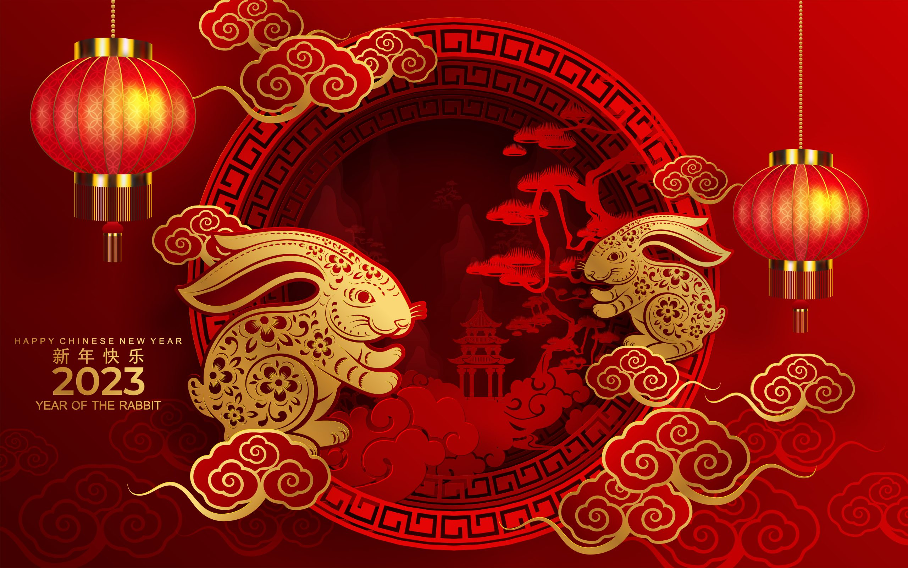
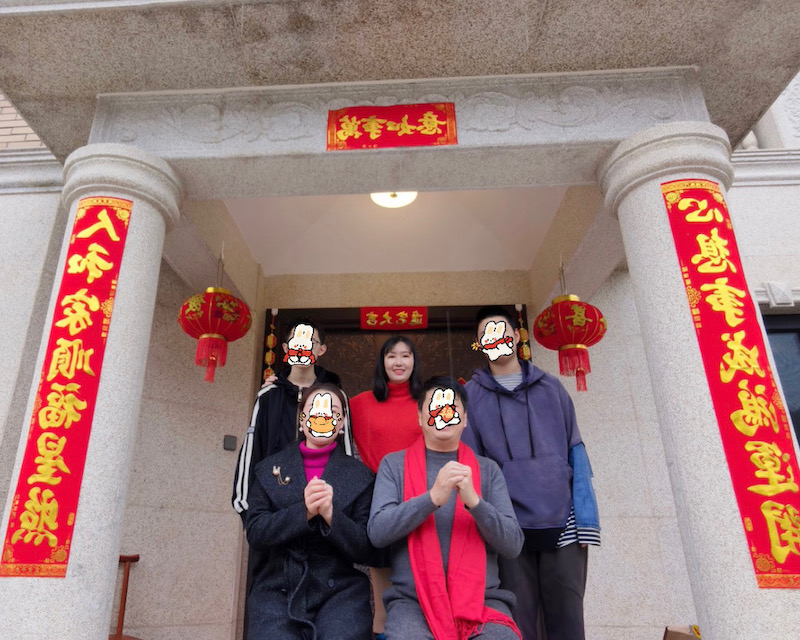
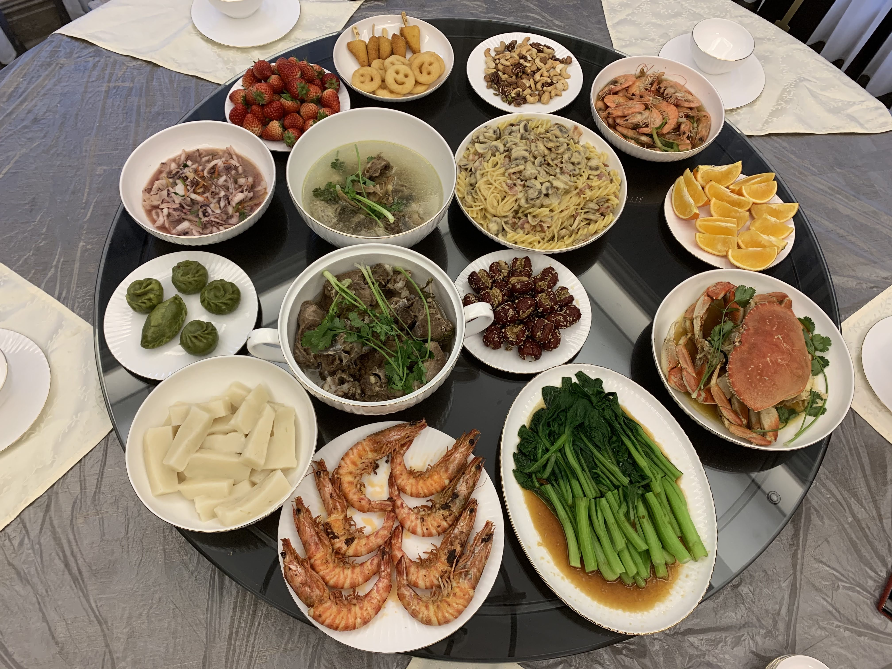
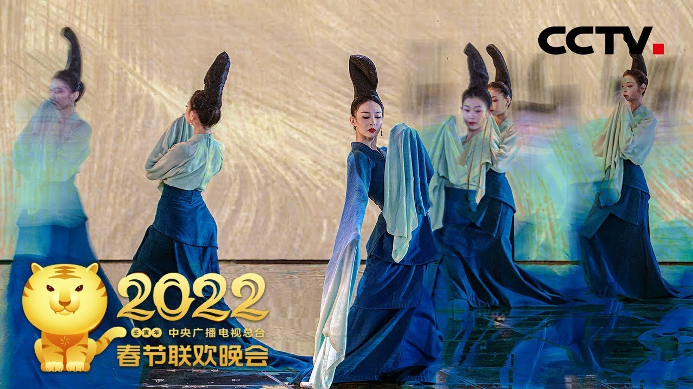
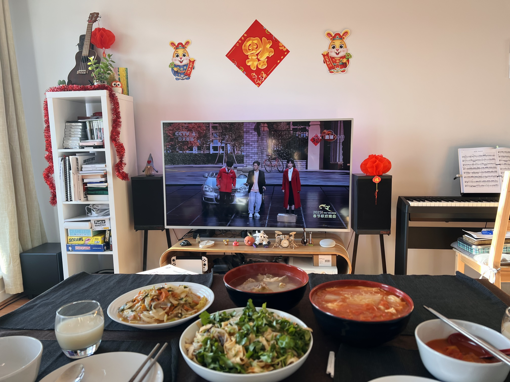
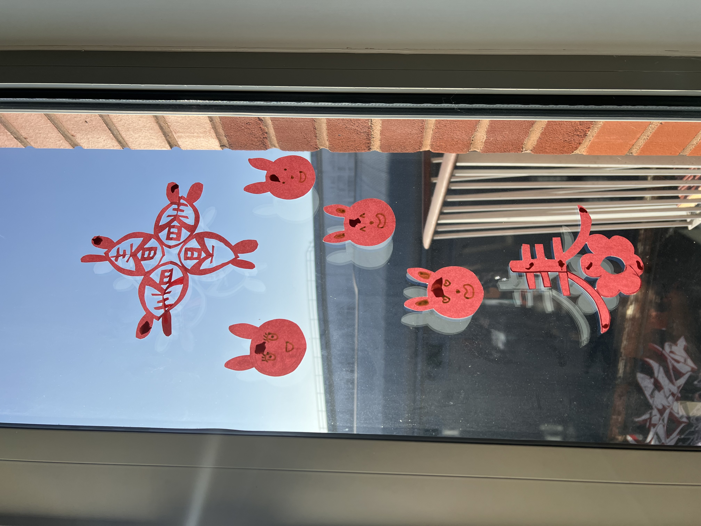
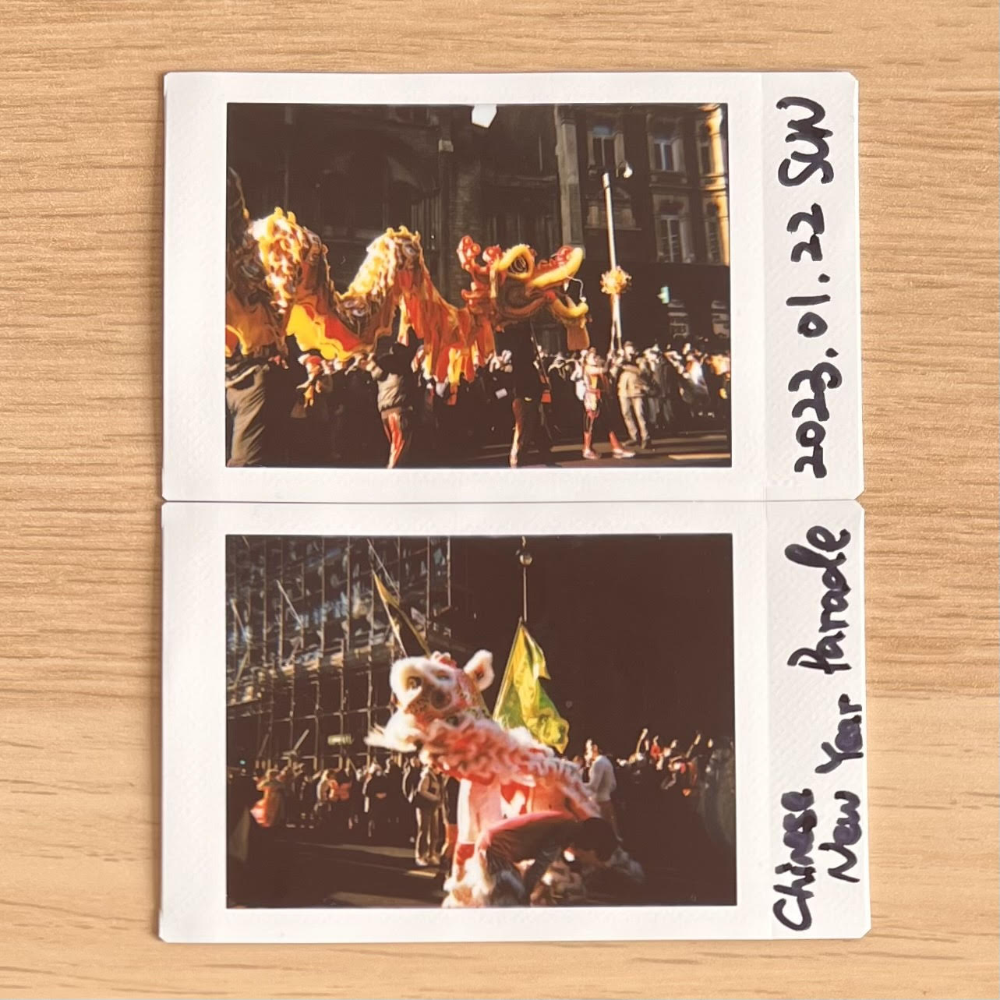

(1)

Two weeks ago, many were celebrating [Chinese New Year](https://chinesenewyear.net/). Chinese New Year 2023 fell on Sunday 22 January, festivities will continue for around 16 days, and end with the [Lantern Festival](https://chinesenewyear.net/lantern-festival/) on 5 February. This time marks the transition between two zodiac signs, 2022 was the Year of the Tiger, and 2023 is the Year of the Rabbit.

As a Chinese person, I’d like to share with you how my family usually celebrates Chinese New Year. 

## Chinese New Year’s Eve
Similar to Christmas Eve, we have Chinese New Year’s Eve as well. This year the Chinese New Year’s Eve was on Saturday 21 January and the Chinese New Year was on Sunday 22 January. 

Usually before the Chinese New Year’s Eve’s day, my family will shop for the following things:
* Decorations - [chunlian](https://chinesenewyear.net/decorations/#:~:text=Spring%20Festival%20Couplets,from%20peach%20trees.) (spring festival couplets), lanterns and decoration with [fu](https://chinesenewyear.net/decorations/#:~:text=into%20the%20household.-,Fortune,paper.%20These%20can%20then%20be%20pasted%20onto%20walls%2C%20doors%20or%20windows.,-Upside%20down%20fu) character on etc.
* New clothes - maybe red clothes

## 2022 (Last year) Chinese New Year

***My family in front of our home last year on Chinese New Year***

My family grew up next to the sea, so we’d always have some seafood dishes on the table. Such as the shrimps, crab, and squid shown in the image below. My family has a strong attachment with inner-mongolia, so we usually have a lamb dish on the table as well. There would be some snack kind of dishes such as the rice cakes and [hongzao](https://www.traditionalhealingarts.com/seasonal-blog/herb-of-the-month-da-zao) (Jujube). You might have noticed that in the image below there’s a big dish of spaghetti. Guess who cooked it? Me! Haha. I wanted to contribute to the dishes and wanted to show my parents what I sometimes cook in the UK.

***Last year’s Chinese New Year’s Eve meal ***

We’d sit around the round table and take what we want to eat onto our plates and dig in! After we finish eating, my parents will give my brothers and me [red envelopes](https://www.chinahighlights.com/travelguide/festivals/red-envelop.htm)🧧. And there’s a traditional activity that all Chinese would do, which is watching the CCTV Spring Festival Gala as shown in the image below. It’s a series of shows including singing and dancing and skits/sketches. Nowadays young people don’t really watch it anymore, but would rather put them as background music. Personally, I think it’s not the same not watching the gala at all. This show continues until midnight and after that we'll light some fireworks and firecrackers. And the next day we’d go visit relatives and greet them with a happy new year.

***This is one of the program from last year’s gala that was great - [The Journey of a Legendary Landscape Painting](https://www.youtube.com/watch?v=aB2kqdk6E9E)***

## 2023 Chinese New Year’s Eve
This year I was celebrating with my partner in London. We decorated our flat with paper lanterns and rabbits etc.. We also made [chuanghua](https://chinesenewyear.net/decorations/#:~:text=Paper%20Cutting%20Arts,sticky%20rice%20glue.), it's quite difficult to make the complicated ones. We also went to see the Chinese New Year Parade. The atmosphere was great!

***We were eating while watching the CCTV Spring Festival Gala***

***The chuanghua we made***

***The Chinese New Year Parade in London***

**Knowledge sharing**: What’s the difference between Chinese New Year and Lunar New Year? The main difference is Chinese New Year is set using both solar and lunar calendars, while lunar new year is solely based on the lunar calendar. For example, for 2023, the lunar new year will be in July. So it's not accurate to call Chinese New Year as Lunar New Year. To be more inclusive, **Spring Festival** is a great alternative name to use.

#### Reference:

(1) [Drinks brands fear curbing of Chinese New Year festivities](https://www.thedrinksbusiness.com/2022/11/drinks-brands-fear-curbing-of-chinese-new-year-festivities/)